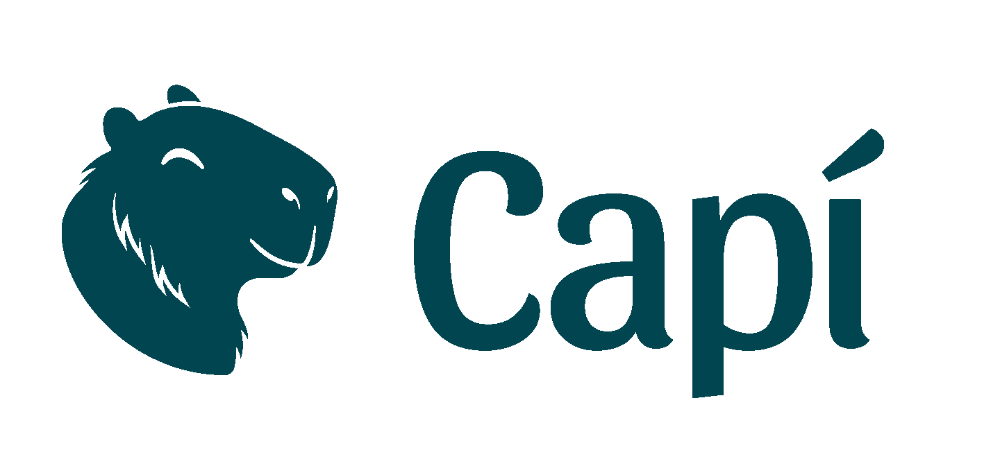

|

<h1 align="center">Documentação | Plano de Comaprtilhamento Codesinfo</h1>

## Sobre a "Capí"

*"Capí: Sua Companheira na Luta contra a Desinformação Ambiental e Climática"*

A Capí é um projeto inovador que utiliza a inteligência artificial para combater a desinformação ambiental e climática e promover a educação ambiental. Através de um chatbot intuitivo e acessível, a Capí oferece informações confiáveis e atualizadas sobre os impactos das mudanças climáticas, seus efeitos na sociedade e no meio ambiente, e as ações que podem ser tomadas para mitigar seus efeitos.

Desenvolvida por uma equipe de especialistas em jornalismo, ciências climáticas e inteligência artificial, a Capí tem como objetivo principal democratizar o acesso a informações científicas sobre o clima, tornando-as compreensíveis e engajadoras para um público amplo, especialmente jovens estudantes.

**As principais funcionalidades da Capí incluem:**

* **Acesso a informações precisas**: A Capí é alimentada por uma base de dados robusta, curada por jornalistas especializados em meio ambiente, e por modelos de linguagem de ponta, como o Gemini, que garantem a confiabilidade e a qualidade das informações fornecidas.

* **Curadoria jornalística**: O conteúdo da Capí é constantemente atualizado e revisado por uma equipe de jornalistas, garantindo que as informações estejam sempre alinhadas com as últimas pesquisas científicas.

* **Engajamento do público**: A Capí utiliza uma linguagem simples e direta, tornando as informações sobre as mudanças climáticas e o meio ambiente mais acessíveis e compreensíveis para todos.

* **Ferramenta educacional**: A Capí pode ser utilizada como uma ferramenta pedagógica em escolas, proporcionando aos estudantes um aprendizado mais interativo e dinâmico sobre as questões ambientais e as mudanças climáticas.

Com a Capí, buscamos construir um futuro mais sustentável, equipando as pessoas com as informações e ferramentas necessárias para tomar decisões mais conscientes e engajar-se na luta contra a desinformação ambiental e climática.

## Sobre Esta Documentação

A presente documentação, que descreve o processo de criação do chatbot Capí, constitui uma das contrapartidas do projeto financiado pelo Fundo Codesinfo.

Conforme estabelecido no Plano de Compartilhamento, o objetivo é disseminar as experiências e conhecimentos adquiridos durante o desenvolvimento do Capí, incentivando a comunidade jornalística a criar soluções similares e a fortalecer o combate à desinformação no Brasil.

Ao compartilhar os detalhes técnicos, as decisões de design e os desafios enfrentados ao longo do processo, buscamos contribuir para a construção de um ecossistema de informações mais confiável e transparente.

## Conteúdo da Documentação

### Sistema
