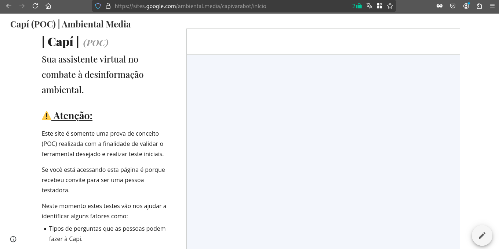
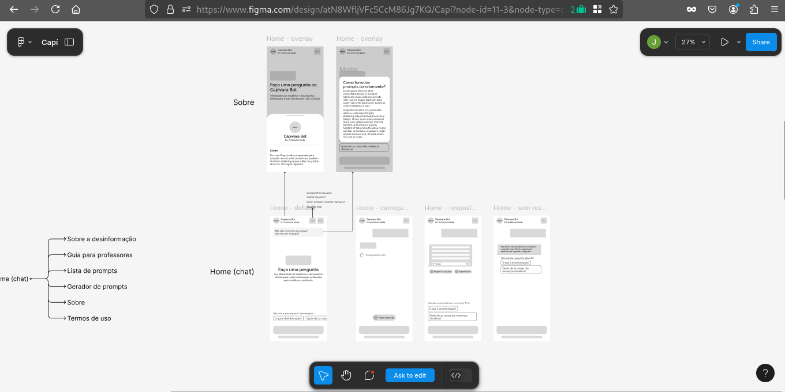
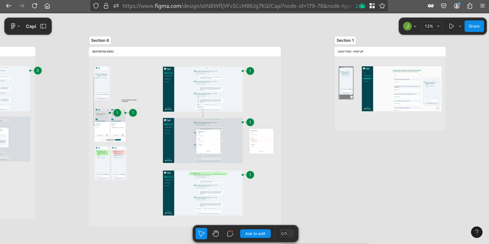

< [Início](/README.md)

# Histórico do Projeto

## Pesquisa e Prototipação

### Mentorias

**A Mentoria como Catalisadora da Inovação no Projeto Capí**

O projeto Capí, uma iniciativa de disseminação de informações precisas sobre o meio ambiente e as mudanças climáticas, contou com um programa de mentorias que se mostrou fundamental para o sucesso da iniciativa. Essa modalidade de acompanhamento especializado proporcionou à equipe do projeto um direcionamento estratégico, técnico e pedagógico, otimizando o desenvolvimento da solução e garantindo que ela atendesse às necessidades dos usuários.

As mentorias técnicas, em particular, foram cruciais para a definição da arquitetura do sistema, a escolha das tecnologias mais adequadas e a resolução de desafios complexos relacionados à inteligência artificial. Com a orientação de especialistas na área, a equipe conseguiu construir uma solução robusta, escalável e capaz de fornecer respostas precisas e relevantes às perguntas dos usuários.

Paralelamente, as mentorias pedagógicas desempenharam um papel fundamental na garantia de que a Capí fosse uma ferramenta útil e engajadora para professores e estudantes. Através de pesquisas e testes com usuários, a equipe conseguiu identificar as necessidades e expectativas do público-alvo, adaptando a interface e as funcionalidades da plataforma para atender a essas demandas.

A combinação de mentorias técnicas e pedagógicas permitiu que o projeto Capí evoluísse de forma ágil e eficiente, superando obstáculos e alcançando resultados significativos. As mentorias proporcionaram à equipe um aprendizado contínuo, estimulando a inovação e a busca por soluções cada vez mais eficazes para o combate à desinformação ambiental.

Em suma, as mentorias foram um investimento fundamental para o sucesso do projeto Capí, contribuindo para o desenvolvimento de uma solução de alta qualidade, alinhada às necessidades dos usuários e com potencial para transformar a forma como as pessoas acessam e compreendem informações sobre o meio ambiente e as mudanças climáticas.

### Pesquisa

**A Pesquisa como Pilar no Projeto Capí**

A fase de pesquisa do projeto Capí foi crucial para a concepção e o desenvolvimento de um assistente virtual capaz de fornecer informações precisas e confiáveis sobre o meio ambiente e as mudanças climáticas. Essa etapa abrangente envolveu a investigação de diversos aspectos, desde as necessidades dos usuários até as soluções tecnológicas disponíveis no mercado.

#### Pesquisas de mercado e interfaces com o usuário:

A fim de garantir uma experiência intuitiva e agradável para os usuários, foram realizadas pesquisas aprofundadas sobre as melhores práticas em design de interfaces conversacionais. Estudos sobre a usabilidade, a acessibilidade e as preferências dos usuários foram essenciais para a definição da interface do Capí. Além disso, foram analisadas as interfaces de outros assistentes virtuais, identificando tanto os pontos fortes quanto as oportunidades de melhoria.

#### Pesquisas sobre fontes de dados e inteligência artificial:

A qualidade das informações fornecidas pelo Capí depende diretamente da qualidade dos dados utilizados para treinar seus modelos de linguagem. Nesse sentido, foram realizadas pesquisas exaustivas para identificar as fontes de dados mais confiáveis e relevantes sobre o meio ambiente e as mudanças climáticas. Foram consideradas tanto fontes acadêmicas, como artigos científicos e relatórios de instituições de pesquisa, quanto fontes jornalísticas de renome.

A seleção das fontes de dados foi realizada com base em critérios rigorosos de qualidade, confiabilidade e relevância. Além disso, foi necessário realizar um trabalho de curadoria para garantir que os dados estivessem formatados de forma adequada para o treinamento dos modelos de linguagem.

#### Pesquisas técnicas sobre arquitetura de assistentes virtuais:

A construção de um assistente virtual baseado em inteligência artificial exige um conhecimento profundo das tecnologias envolvidas. Nesse sentido, foram realizadas pesquisas aprofundadas sobre as diferentes arquiteturas de sistemas de conversação, as melhores práticas em processamento de linguagem natural e as ferramentas disponíveis para o desenvolvimento de modelos de linguagem.

Foram avaliadas diversas opções de plataformas de desenvolvimento, frameworks e bibliotecas de software, considerando aspectos como escalabilidade, custo, facilidade de uso e integração com outras ferramentas. A escolha da arquitetura ideal foi fundamental para garantir o desempenho e a robustez do sistema.

#### Pesquisas sobre ferramentas e serviços:

O mercado oferece uma ampla variedade de ferramentas e serviços que podem ser utilizados para o desenvolvimento de assistentes virtuais. A equipe do projeto Capí realizou uma pesquisa exaustiva para identificar as soluções mais adequadas para cada etapa do desenvolvimento.

Foram avaliadas ferramentas para a construção de interfaces conversacionais, plataformas de desenvolvimento de modelos de linguagem, serviços de armazenamento de dados e ferramentas de análise de dados. A escolha das ferramentas e serviços foi realizada com base em critérios técnicos, econômicos e de compatibilidade com a arquitetura do sistema.

Em resumo, a fase de pesquisa do projeto Capí foi fundamental para garantir o sucesso da iniciativa. Através de uma investigação aprofundada das necessidades dos usuários, das tecnologias disponíveis e das melhores práticas do mercado, foi possível desenvolver um assistente virtual inovador e capaz de fornecer informações precisas e confiáveis sobre o meio ambiente e as mudanças climáticas.

A pesquisa contínua é um dos pilares do projeto Capí, garantindo que a plataforma se mantenha atualizada e relevante, adaptando-se às novas demandas e desafios do cenário ambiental.

### Prototipação

**A Prototipação da Capí: Da Ideia à Materialidade**

A fase de prototipação do projeto Capí foi um marco fundamental na trajetória de transformar uma ideia promissora em uma ferramenta concreta e eficaz para o combate à desinformação ambiental. Através da criação de protótipos, a equipe conseguiu tangibilizar a visão inicial, testar hipóteses e coletar feedbacks valiosos para aprimorar a solução.

A prova de conceito (POC) representou o primeiro passo nessa jornada. A POC, um protótipo funcional e simplificado, foi crucial para validar a viabilidade técnica da solução. Ao simular as interações básicas do usuário com o chatbot, a equipe pôde validar a execução técnica do sistema idealizado, utilizando as ferramentas e serviços pesquisados e escolhidos. Essa etapa foi fundamental para garantir que a arquitetura do sistema, definida com base nas pesquisas realizadas, fosse capaz de suportar as funcionalidades desejadas.

**A POC permitiu:**

* **Validar a arquitetura do sistema**: A POC serviu como um teste para a arquitetura do sistema, permitindo identificar e corrigir possíveis problemas de design e implementação.
* **Experimentar diferentes tecnologias**: A equipe pôde experimentar diferentes tecnologias e ferramentas, escolhendo aquelas que melhor se adaptavam às necessidades do projeto.
* **Demonstrar a viabilidade do projeto**: A POC foi fundamental para convencer os stakeholders da viabilidade do projeto e garantir o apoio necessário para sua continuidade.

Em paralelo à POC, a equipe desenvolveu um protótipo da interface do usuário, utilizando wireframes de baixa fidelidade. Essa representação visual simplificada da interface permitiu visualizar a experiência do usuário de forma intuitiva e identificar oportunidades de melhoria. Ao apresentar o protótipo a um grupo de usuários, a equipe conseguiu coletar feedbacks valiosos sobre a usabilidade, a navegabilidade e a clareza das informações apresentadas.

A prototipação iterativa foi fundamental para garantir que a Capí fosse uma ferramenta intuitiva e fácil de usar. A cada ciclo de prototipação, a equipe refinava o design da interface, ajustava as funcionalidades e coletava novos feedbacks. Essa abordagem ágil permitiu que a equipe adaptasse rapidamente a solução às necessidades dos usuários e às novas descobertas durante o desenvolvimento.

Em resumo, a prototipação foi um elemento central no processo de desenvolvimento da Capí. Através da criação de protótipos, a equipe conseguiu validar hipóteses, identificar e corrigir problemas, coletar feedbacks e garantir que a solução final atendesse às expectativas dos usuários. A prototipação iterativa permitiu que o Capí evoluísse de forma ágil e eficiente, tornando-se uma ferramenta cada vez mais sofisticada e útil para o combate à desinformação ambiental.

A importância da prototipação para o sucesso do projeto Capí pode ser resumida em três pontos principais:

* **Redução de riscos**: Ao identificar e corrigir problemas nas fases iniciais do desenvolvimento, a prototipação minimizou os riscos de falhas e atrasos no projeto.
* **Melhora da qualidade**: A coleta de feedbacks e a iteração contínua permitiram que a equipe entregasse um produto final de alta qualidade, que atende às necessidades dos usuários.
* **Aumento da agilidade**: A prototipação ágil permitiu que a equipe se adaptasse rapidamente às mudanças e às novas descobertas durante o desenvolvimento.

Em suma, a prototipação foi um investimento fundamental para o sucesso do projeto Capí, garantindo que a solução fosse desenvolvida de forma eficiente e eficaz, e que atendesse às necessidades dos seus usuários.

## Desenvolvimento

### Elaboração dos projetos definitivos

A fase de elaboração dos projetos representou um marco crucial na transformação de uma ideia inovadora em uma solução concreta e eficaz para o combate à desinformação ambiental. Nesta etapa, a elaboração de projetos detalhados se mostrou fundamental para garantir a alinhamento entre as diferentes equipes envolvidas e a entrega de um produto de alta qualidade.

Dois projetos, em particular, se destacaram por sua importância neste processo: o projeto de interface com o usuário (UI) e o projeto de arquitetura de sistema.

#### O Projeto de Interface com o Usuário (UI): A Experiência do Usuário em Detalhes

Com base no wireframe de baixa fidelidade, elaborado nas etapas iniciais do projeto, a equipe de design deu vida à interface da Capí através do Figma. Essa ferramenta de design colaborativo permitiu a criação de um artefato visual completo e detalhado, contendo todas as telas, fluxos de navegação e conteúdos que compõem a experiência do usuário.

O projeto de UI serviu como um guia preciso para os desenvolvedores front-end, que utilizaram essas informações para construir a interface visual da aplicação. Ao ter acesso a um projeto de UI bem elaborado, os desenvolvedores puderam:

* **Compreender a visão geral da interface**: O projeto de UI ofereceu uma visão completa da interface, facilitando a compreensão da estrutura e da hierarquia das informações.
* **Implementar os componentes visuais**: Os desenvolvedores puderam utilizar o projeto de UI como referência para criar os componentes visuais da interface, garantindo a consistência e a qualidade do design.
* **Resolver dúvidas e conflitos**: Em caso de dúvidas ou divergências, o projeto de UI serviu como um documento de referência para resolver conflitos e garantir que a implementação estivesse alinhada com a visão original.

#### O Projeto de Arquitetura de Sistema: A Estrutura Interna da Capí

Paralelamente ao desenvolvimento da interface, a equipe técnica elaborou o projeto de arquitetura de sistema. Baseado na arquitetura validada na prova de conceito (POC), este projeto detalhou os componentes que compõem o sistema, suas interações e os fluxos de informações.

O projeto de arquitetura de sistema foi um documento fundamental para todos os envolvidos no desenvolvimento da Capí, incluindo os desenvolvedores front-end, back-end e infraestrutura. Ele serviu como uma referência para:

* **Definir a estrutura do sistema**: O projeto de arquitetura definiu a estrutura do sistema, indicando os módulos, componentes e serviços que o compõem.
* **Estabelecer as relações entre os componentes**: O projeto detalhou as relações entre os diferentes componentes do sistema, como a forma como eles se comunicam e trocam informações.
* **Orientar o desenvolvimento**: O projeto de arquitetura serviu como um guia para os desenvolvedores, orientando-os na implementação de cada componente do sistema.
* **Facilitar a manutenção**: Um projeto de arquitetura bem definido facilitou a manutenção do sistema ao longo do tempo, permitindo que novas funcionalidades fossem adicionadas e que problemas fossem corrigidos de forma eficiente.

### A Importância da Elaboração de Projetos no Desenvolvimento da Capí

Em resumo, a elaboração de projetos detalhados de interface e arquitetura foi um passo crucial no desenvolvimento da Capí. Ao garantir a clareza e a organização do processo de desenvolvimento, esses projetos contribuíram significativamente para o sucesso do projeto como um todo.

### Execução e Desenvolvimento

A fase de execução e desenvolvimento do projeto Capí representou um momento crucial na transformação da visão inicial em uma ferramenta robusta e eficaz para o combate à desinformação ambiental. Nesta etapa, diversas atividades foram realizadas para garantir que a Capí atendesse aos requisitos técnicos e funcionais estabelecidos.

#### Curadoria e Preparação das Bases de Dados

A construção de uma base de conhecimento sólida e confiável foi fundamental para o funcionamento da Capí. A equipe responsável pela curadoria de dados se dedicou a coletar, organizar e preparar informações precisas e atualizadas sobre meio ambiente e mudanças climáticas. Essa base de dados serviu como o alicerce para as respostas da Capí, garantindo que as informações fornecidas fossem sempre relevantes e confiáveis.

#### Preparação de Conteúdo para o Prompt Tuning

Para garantir que a Capí interagisse com os usuários de forma natural e eficiente, foi necessário um processo de "aprendizado" denominado prompt tuning. Nesse processo, foram criados diversos tipos de conteúdo, como:

* **Textos de conversação exemplo**: Esses textos simularam conversas entre a Capí e um usuário, ajudando a "ensinar" à ferramenta o tom de voz, a formalidade e a maneira de abordar diferentes assuntos.
* **Listas de perguntas e respostas**: Essas listas foram elaboradas para ensinar a Capí a lidar com perguntas complexas, com viés, conteúdo malicioso ou que fugissem do escopo de atuação da ferramenta.

#### Provisionamento da Infraestrutura em Nuvem

A equipe de infraestrutura provisionou todos os recursos computacionais necessários para o funcionamento da aplicação, incluindo redes, baleanceadores de carga, segmentação de ambientes, bancos de dados, recursos Serverless, serviços de armazenamento, entre outros.

#### Provisionamento e Configuração das Esteiras de DevOps

Para garantir um ciclo de desenvolvimento ágil, seguro e contínuo, foram implementadas esteiras de DevOps. Essas esteiras automatizaram diversas tarefas, como a construção, o teste e a implantação da aplicação, reduzindo o tempo de desenvolvimento e aumentando a qualidade do software.

#### Execução do Front-End e Back-End

A interface visual da Capí, projetada no Figma, foi implementada utilizando a tecnologia Next.js. Essa escolha permitiu a criação de uma interface rápida, responsiva e com excelente desempenho. O back-end, também desenvolvido com Next.js, foi responsável por integrar a inteligência artificial à interface, permitindo que os usuários interagissem com a Capí de forma natural e intuitiva.

#### Execução da Inteligência Artificial

A inteligência artificial foi o coração da Capí. Através de modelos de linguagem avançados e da técnica de RAG, a Capí foi implementada para entender as perguntas dos usuários, buscar as informações relevantes na base de dados e gerar respostas precisas e concisas. O processo de treinamento da inteligência artificial foi realizado utilizando as técnicas de prompt tuning e aprendizado de máquina.

#### Conclusão

A fase de execução e desenvolvimento do projeto Capí foi marcada por um intenso trabalho de equipe e pela utilização de tecnologias de ponta. A combinação de uma base de dados robusta, um modelo de linguagem avançado e uma arquitetura de software escalável permitiu a criação de uma ferramenta poderosa para o combate à desinformação ambiental. 

## Processo de Qualidade

### Testes com Usuários

### Testes de Tecnologia

