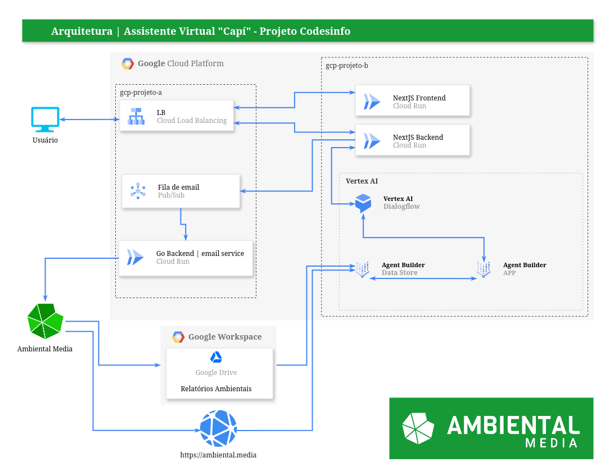

< [Início](/README.md)


*(⚠️ Work in Progress ⚠️)*

# Sistema

## Arquitetura do Sistema

Diagrama simplificado da arquitetura do sistema:

<p align="center"></p>

### Visão Geral

O assistente virtual "Capí" é uma solução baseada em nuvem, construída sobre a plataforma Google Cloud Platform (GCP), que oferece um serviço de atendimento ao usuário através de uma interface web intuitiva. O sistema foi projetado para fornecer respostas precisas e relevantes a perguntas sobre temas ambientais, utilizando tecnologias de ponta em inteligência artificial, como o modelo de linguagem de grande porte (LLM) Gemini e o mecanismo de busca semântica RAG (Retrieval Augmented Generation).

### Descrição da Arquitetura do Sistema

A arquitetura do sistema "Capí" pode ser dividida em três camadas principais:

#### 1. Camada de Apresentação:

**Frontend (Next.js)**: Responsável pela interface do usuário, onde as interações com o assistente virtual ocorrem.

**Backend (Next.js)**: Lida com a lógica de negócio, processando as solicitações do usuário e encaminhando-as para o modelo de linguagem.

#### 2. Camada de Inteligência Artificial:

**Vertex AI**: Abriga os componentes de inteligência artificial, incluindo:

* **Dialogflow**: Responsável pela interface de conversação com o usuário, interpretando as perguntas e gerando as respostas iniciais.
* **Agent Builder**: Cria e gerencia o agente virtual, que utiliza o modelo de linguagem Gemini para gerar respostas mais complexas e personalizadas, baseadas nas informações armazenadas no Data Store.
* **Data Store**: Armazena os dados utilizados pelo modelo de linguagem, como artigos, relatórios e outras informações relevantes sobre o meio ambiente.

#### 3. Camada de Infraestrutura:

**Google Cloud Platform**: Fornece a infraestrutura em nuvem para hospedar todos os componentes do sistema, incluindo:

* **Cloud Run**: Plataforma serverless para executar os serviços frontend e backend.
* **Load Balancing**: Distribui o tráfego entre as instâncias dos serviços.
* **Pub/Sub**: Plataforma de mensagens assíncronas utilizada para enviar e-mails.
* **Google Workspace**: Armazena documentos e colabora com a equipe de desenvolvimento.

### Detalhes Técnicos

#### Agent Builder e Data Store:

* O Agent Builder utiliza o modelo de linguagem Gemini para gerar respostas personalizadas e informativas.
* O Data Store armazena os dados em um formato otimizado para o mecanismo de busca semântica RAG, permitindo que o modelo de linguagem encontre rapidamente as informações relevantes para responder às perguntas do usuário.
* O Data Store é composto por:
  * Conteúdo do website da Ambiental Media.
  * Dados não estruturados de relatórios ambientais.

#### Vantagens da Arquitetura:

* **Escalabilidade**: A arquitetura baseada em nuvem permite escalar os recursos de forma rápida e fácil para atender à demanda.
* **Flexibilidade**: A utilização de serviços gerenciados pela GCP simplifica a gestão da infraestrutura e permite focar no desenvolvimento do sistema.
* **Eficiência**: A utilização de modelos de linguagem de grande porte e o mecanismo de busca semântica RAG permitem gerar respostas precisas e relevantes com menor esforço computacional.
* **Sustentabilidade**: A maior parte dos recursos está alocada em regiões com servidores LowCO2 da GCP, reduzindo o impacto ambiental.

### Eficiência Energética e Sustentabilidade

A arquitetura do sistema "Capí" foi projetada com foco na eficiência energética e sustentabilidade:

* **RAG**: A técnica de RAG evita o retreinamento constante do modelo de linguagem, reduzindo o consumo de energia e os custos computacionais.
* **Servidores LowCO2**: A utilização de servidores LowCO2 da GCP em regiões como us-central1 contribui para reduzir a pegada de carbono do sistema.

### RAG e Desafios da Busca Semântica

#### O que é RAG?

RAG, sigla para Retrieval Augmented Generation, é uma técnica que combina a capacidade de geração de texto de modelos de linguagem de grande porte (LLMs) com a recuperação de informações relevantes de um banco de dados. Em outras palavras, o RAG permite que um modelo de linguagem não apenas gere texto, mas também busque informações específicas em uma base de conhecimento para enriquecer suas respostas.

#### Como funciona o RAG no contexto do "Capí"?

1.  **Consulta do usuário**: O usuário faz uma pergunta ao assistente virtual.
2.  **Busca semântica**: O sistema utiliza técnicas de busca semântica para encontrar os documentos mais relevantes na base de dados que contenham a resposta para a pergunta.
3.  **Geração da resposta**: O modelo de linguagem (Gemini) utiliza as informações encontradas na etapa anterior para gerar uma resposta completa e coerente para o usuário.

#### Desafios da Implementação de um Sistema de Busca Semântica

Implementar um sistema de busca semântica eficiente e eficaz apresenta diversos desafios:

##### Representação semântica:

* **Embeddings**: Transformar palavras e frases em vetores numéricos (embeddings) que capturem o significado semântico é um desafio complexo.
* **Escolha do modelo**: Existem diversos modelos de embeddings disponíveis, cada um com suas vantagens e desvantagens. A escolha do modelo ideal depende da natureza dos dados e dos objetivos da aplicação.

##### Indexação e busca:

* **Escala**: Indexar grandes volumes de dados e realizar buscas eficientes nesses dados exige infraestrutura robusta e algoritmos otimizados.
* **Relevância**: Garantir que os resultados da busca sejam relevantes para a consulta do usuário é um desafio constante, pois a linguagem natural é ambígua e contextualmente dependente.

##### Qualidade dos dados:

* **Limpeza e preparação**: Os dados precisam ser limpos, formatados e preparados para a indexação.
* **Atualização**: A base de dados deve ser constantemente atualizada para garantir que as informações sejam precisas e relevantes.

##### Avaliação:

* **Métricas**: É difícil definir métricas precisas para avaliar a qualidade das respostas geradas por um sistema RAG.
* **Subjetividade**: A avaliação da qualidade das respostas muitas vezes é subjetiva e depende do contexto da consulta.

#### Considerações Adicionais

* **Custo computacional**: A criação e o treinamento de modelos de linguagem de grande porte, assim como a realização de buscas semânticas em grandes bases de dados, podem ser computacionalmente caros.
* **Privacidade**: Ao lidar com grandes volumes de dados, é fundamental garantir a privacidade dos usuários e o cumprimento das leis de proteção de dados.
* **Bias**: Modelos de linguagem podem apresentar vieses presentes nos dados de treinamento. É importante tomar medidas para mitigar esses vieses e garantir que o sistema seja justo e imparcial.

**Em resumo**, o **RAG** é uma tecnologia promissora que permite criar assistentes virtuais mais inteligentes e informativos. No entanto, a implementação de um sistema de busca semântica eficaz exige um profundo conhecimento em áreas como processamento de linguagem natural, aprendizado de máquina e engenharia de dados.

### Prompt Tuning e Eficiência Energética em Sistemas RAG

#### O que é Prompt Tuning?

Prompt tuning é uma técnica de ajuste fino de modelos de linguagem de grande porte (LLMs) que consiste em fornecer exemplos e instruções específicas (prompts) para guiar a geração de texto. Em vez de treinar todo o modelo com uma grande quantidade de dados, o prompt tuning permite ajustar o comportamento do modelo de forma mais rápida e eficiente, fornecendo exemplos relevantes para a tarefa em questão.

#### Como o Prompt Tuning Contribui para a Eficiência Energética?

* **Menor treinamento**: Ao invés de treinar todo o modelo, o prompt tuning ajusta o comportamento do modelo existente, o que requer menos recursos computacionais e, consequentemente, menos energia.
* **Resultados mais precisos**: Prompts bem elaborados podem levar a resultados mais precisos e relevantes, reduzindo a necessidade de gerar e descartar várias respostas até encontrar a ideal.
* **Adaptação mais rápida**: O prompt tuning permite adaptar o modelo a novas tarefas ou domínios de forma mais rápida, o que é crucial em um cenário em constante evolução.

#### Prompt Tuning no Vertex AI Agent Builder

O Vertex AI Agent Builder oferece um ambiente ideal para realizar o prompt tuning, com recursos como:

* **Goals**: Define o objetivo geral do agente, como fornecer informações precisas, gerar textos criativos ou manter uma conversa fluida.
* **Instructions**: Fornece instruções específicas sobre como o agente deve responder a diferentes tipos de perguntas ou solicitações.
* **Examples**: Apresenta exemplos de conversas e as respostas esperadas do agente, permitindo que o modelo aprenda padrões e nuances da linguagem.

**Exemplo de uso:**

Imagine que você deseja que o agente "Capí" seja mais conciso em suas respostas. Você poderia adicionar a seguinte instrução:

```
"Sua resposta deve ser clara, concisa e direta ao ponto."
```

E fornecer alguns exemplos de perguntas e respostas curtas e objetivas.

#### Prompt Tuning e Eficiência Energética

O prompt tuning oferece uma forma mais eficiente energeticamente de adaptar modelos de linguagem de grande porte a novas tarefas. Ao evitar o retreinamento completo do modelo, o prompt tuning reduz significativamente o consumo de energia e o tempo de treinamento, tornando-o uma ferramenta poderosa para o desenvolvimento de aplicações de IA.

Em outras palavras, o prompt tuning é como dar novas instruções a um modelo já treinado, em vez de ensiná-lo tudo novamente do zero.

#### Benefícios Adicionais do Prompt Tuning

Além da eficiência energética, o prompt tuning oferece outros benefícios, como:

* **Personalização**: Permite personalizar o comportamento do agente para diferentes usuários ou contextos.
* **Flexibilidade**: Facilita a adaptação do agente a novas tarefas e requisitos.
* **Melhoria contínua**: Permite realizar ajustes finos contínuos para melhorar o desempenho do agente ao longo do tempo.

**Em resumo**, o prompt tuning é uma técnica poderosa para refinar modelos de linguagem de grande porte, como os utilizados no sistema "Capí". Ao fornecer instruções e exemplos específicos, é possível obter resultados mais precisos e relevantes, com menor consumo de energia e maior flexibilidade. O Vertex AI Agent Builder oferece um ambiente ideal para experimentar e refinar prompts, permitindo que você crie agentes personalizados e eficientes.

