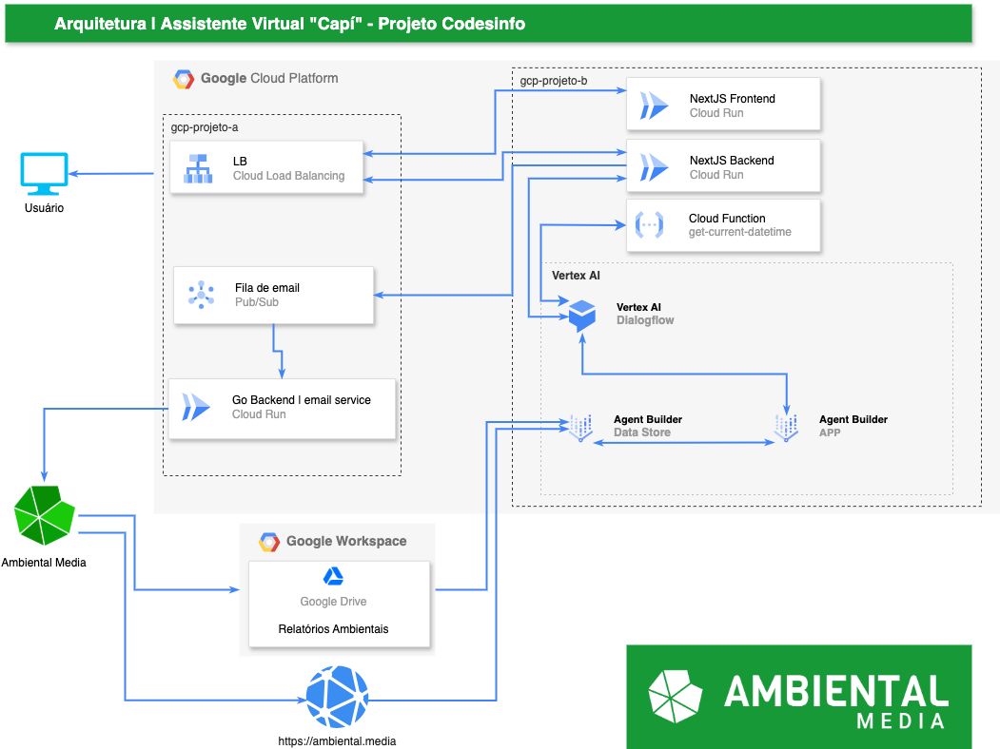

< [Início](/README.md)


# Sistema

## Arquitetura do sistema

Diagrama simplificado da arquitetura do sistema:

<p align="center"></p>

### Visão Geral

A assistente virtual Capí é uma solução baseada em nuvem, construída sobre a plataforma Google Cloud Platform (GCP), que oferece um serviço de atendimento ao usuário por meio de uma interface web intuitiva. O sistema foi projetado para fornecer respostas precisas e relevantes a perguntas sobre temas ambientais, utilizando tecnologias de ponta em inteligência artificial, como o modelo de linguagem de grande porte (LLM) Gemini e o mecanismo de busca semântica RAG (Retrieval-augmented generation).

### Descrição da arquitetura do sistema

A arquitetura do sistema Capí pode ser dividida em três camadas principais:

#### 1. Camada de apresentação:

**Front-end (Next.js)**: responsável pela interface do usuário, onde as interações com a assistente virtual ocorrem;

**Back-end (Next.js)**: lida com a lógica de negócio, processando as solicitações do usuário e encaminhando-as para o modelo de linguagem.

#### 2. Camada de inteligência artificial:

Vertex AI: abriga os componentes de inteligência artificial, incluindo:

* Dialogflow: responsável pela interface de conversação com o usuário, interpretando as perguntas e gerando as respostas iniciais;
* Agent Builder: cria e gerencia o agente virtual, que utiliza o modelo de linguagem Gemini para gerar respostas mais complexas e personalizadas, baseadas nas informações armazenadas no Data Store;
* Data Store: armazena os dados utilizados pelo modelo de linguagem, como artigos, relatórios e outras informações relevantes sobre o meio ambiente.

#### 3. Camada de infraestrutura:

A Google Cloud Platform fornece a infraestrutura em nuvem para hospedar todos os componentes do sistema, incluindo:

* Cloud Run: plataforma serverless para executar os serviços frontend e backend;
* Load Balancing: distribui o tráfego entre as instâncias dos serviços;
* Pub/Sub: plataforma de mensagens assíncronas utilizada para enviar e-mails;
* Google Workspace: armazena documentos e colabora com a equipe de desenvolvimento.

### Detalhes Técnicos

#### Agent Builder e Data Store:

* O Agent Builder utiliza o modelo de linguagem Gemini para gerar respostas personalizadas e informativas;
* O Data Store armazena os dados em um formato otimizado para o mecanismo de busca semântica RAG, permitindo que o modelo de linguagem encontre rapidamente as informações relevantes para responder às perguntas do usuário;
* O Data Store é composto por:
    * Conteúdo do website da Ambiental Media
    * Dados não estruturados de estudos científicos selecionados pelos editores da Ambiental Media.

#### Vantagens da arquitetura:

* Escalabilidade: a arquitetura baseada em nuvem permite escalar os recursos de forma rápida e fácil para atender à demanda;
* Flexibilidade: a utilização de serviços gerenciados pela GCP simplifica a gestão da infraestrutura e permite focar no desenvolvimento do sistema;
* Eficiência energética e sustentabilidade: a utilização de modelos de linguagem de grande porte e o mecanismo de busca semântica RAG permitem gerar respostas precisas e relevantes com menor esforço computacional; e a maior parte dos recursos está alocada em regiões com servidores LowCO2 da GCP, como o us-central1, reduzindo o impacto ambiental.

### Eficiência Energética e Sustentabilidade

A arquitetura do sistema Capí foi projetada com foco na eficiência energética e sustentabilidade:

* RAG: a técnica de RAG evita o retreinamento constante do modelo de linguagem, reduzindo o consumo de energia e os custos computacionais;
* Servidores LowCO2: a utilização de servidores LowCO2 da GCP em regiões como us-central1 contribui para reduzir a pegada de carbono do sistema.

### RAG e Desafios da busca semântica

#### O que é RAG?

RAG, sigla para retrieval-augmented generation, é uma técnica que combina a capacidade de geração de texto de modelos de linguagem de grande porte (LLMs) com a recuperação de informações relevantes de um banco de dados. Em outras palavras, o RAG permite que um modelo de linguagem não apenas gere texto, mas também busque informações específicas em uma base de conhecimento para enriquecer suas respostas.

#### Como funciona o RAG no contexto da Capí?

1.  **Consulta do usuário**: o usuário faz uma pergunta ao assistente virtual;
2.  **Busca semântica**: o sistema utiliza técnicas de busca semântica para encontrar os documentos mais relevantes na base de dados que contenham a resposta para a pergunta;
3.  **Geração da resposta**: o modelo de linguagem (Gemini) utiliza as informações encontradas na etapa anterior para gerar uma resposta completa e coerente para o usuário.

#### Desafios da Implementação de um Sistema de Busca Semântica

Implementar um sistema de busca semântica eficiente e eficaz apresenta diversos desafios:

##### Representação semântica:

* **Embeddings**: transformar palavras e frases em vetores numéricos (embeddings) que capturem o significado semântico é um desafio complexo;
* **Escolha do modelo**: existem diversos modelos de embeddings disponíveis, cada um com suas vantagens e desvantagens. A escolha do modelo ideal depende da natureza dos dados e dos objetivos da aplicação.

##### Indexação e busca:

* **Escala**: indexar grandes volumes de dados e realizar buscas eficientes nesses dados exige infraestrutura robusta e algoritmos otimizados;
* **Relevância**: garantir que os resultados da busca sejam relevantes para a consulta do usuário é um desafio constante, pois a linguagem natural é ambígua e contextualmente dependente.

##### Qualidade dos dados:

* **Limpeza e preparação**: os dados precisam ser limpos, formatados e preparados para a indexação;
* **Atualização**: a base de dados deve ser constantemente atualizada para garantir que as informações sejam precisas e relevantes.

##### Avaliação:

* **Métricas**: é difícil definir métricas precisas para avaliar a qualidade das respostas geradas por um sistema RAG;
* **Subjetividade**: a avaliação da qualidade das respostas muitas vezes é subjetiva e depende do contexto da consulta.

#### Considerações Adicionais

* **Custo computacional**: a criação e o treinamento de modelos de linguagem de grande porte, assim como a realização de buscas semânticas em grandes bases de dados, podem ser computacionalmente caros;
* **Privacidade**: ao lidar com grandes volumes de dados, é fundamental garantir a privacidade dos usuários e o cumprimento das leis de proteção de dados;
* **Bias**: modelos de linguagem podem apresentar vieses presentes nos dados de treinamento. É importante tomar medidas para mitigar esses vieses e garantir que o sistema seja justo e imparcial.

**Em resumo**, o **RAG** é uma tecnologia promissora que permite criar assistentes virtuais mais inteligentes e informativos. No entanto, a implementação de um sistema de busca semântica eficaz exige um profundo conhecimento em áreas como processamento de linguagem natural, aprendizado de máquina e engenharia de dados.

### Prompt tuning e eficiência energética em sistemas RAG

#### O que é prompt tuning?

Prompt tuning é uma técnica de ajuste fino de modelos de linguagem de grande porte (LLMs) que consiste em fornecer exemplos e instruções específicas (prompts) para guiar a geração de texto. Em vez de treinar todo o modelo com uma grande quantidade de dados, o prompt tuning permite ajustar o comportamento do modelo de forma mais rápida e eficiente, fornecendo exemplos relevantes para a tarefa em questão.

#### Como o prompt tuning contribui para a eficiência energética?

* **Menor treinamento**: ao invés de treinar todo o modelo, o prompt tuning ajusta o comportamento do modelo existente, o que requer menos recursos computacionais e, consequentemente, menos energia;
* **Resultados mais precisos**: prompts bem elaborados podem levar a resultados mais precisos e relevantes, reduzindo a necessidade de gerar e descartar várias respostas até encontrar a ideal;
* **Adaptação mais rápida**: o prompt tuning permite adaptar o modelo a novas tarefas ou domínios de forma mais rápida, o que é crucial em um cenário em constante evolução.

#### Benefícios adicionais do prompt tuning

Além da eficiência energética, o prompt tuning oferece outros benefícios, como:

* **Personalização**: permite personalizar o comportamento do agente para diferentes usuários ou contextos;
* **Flexibilidade**: facilita a adaptação do agente a novas tarefas e requisitos;
* **Melhoria contínua**: permite realizar ajustes finos contínuos para melhorar o desempenho do agente ao longo do tempo.


#### Prompt Tuning no Vertex AI Agent Builder

O Vertex AI Agent Builder oferece um ambiente ideal para realizar o prompt tuning, com recursos como:

* **Goals**: define o objetivo geral do agente, como fornecer informações precisas, gerar textos criativos ou manter uma conversa fluida;
* **Instructions**: fornece instruções específicas sobre como o agente deve responder a diferentes tipos de perguntas ou solicitações;
* **Examples**: apresenta exemplos de conversas e as respostas esperadas do agente, permitindo que o modelo aprenda padrões e nuances da linguagem.

**Exemplo de uso**:

Imagine que você deseja que a agente Capí seja mais conciso em suas respostas. Você poderia adicionar a seguinte instrução:

```
"Sua resposta deve ser clara, concisa e direta ao ponto."
```

E fornecer alguns exemplos de perguntas e respostas curtas e objetivas.

